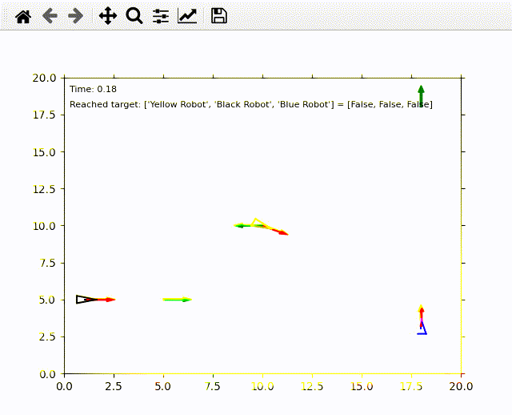
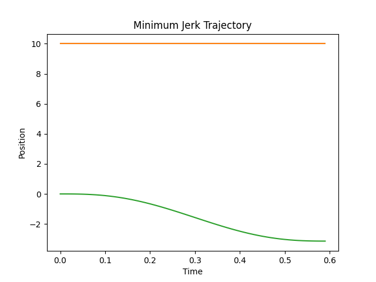
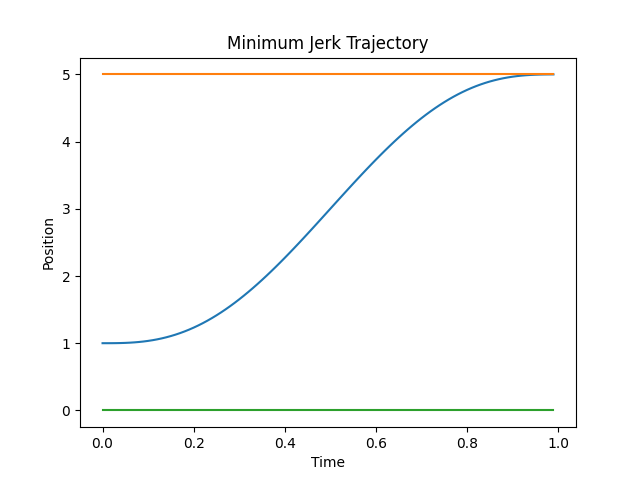
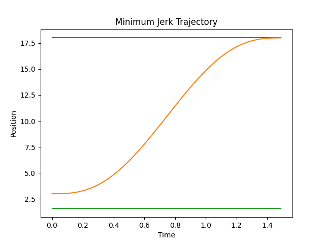

# Trajectory Planning

A minimum jerk trajectory generation basic script right now, planning on adding more trajectory generators.

## Disclamer

This is a relative move planner for on pose rotation and single axis translations for differential drive robots. It creates minimum jerk smooth profiles - an improvement to nav2's spin recovery controller.

## How To

1. Tune simulation parameters in `trajectory_planner/simulation.py`
2. Create your robots, their initial/final poses and the total time needed for them to reach their goal in `main.py`
3. Run `python3 main.py`

## Simulation

## Trajectory (one plot per Pose elements (x, y, theta))

